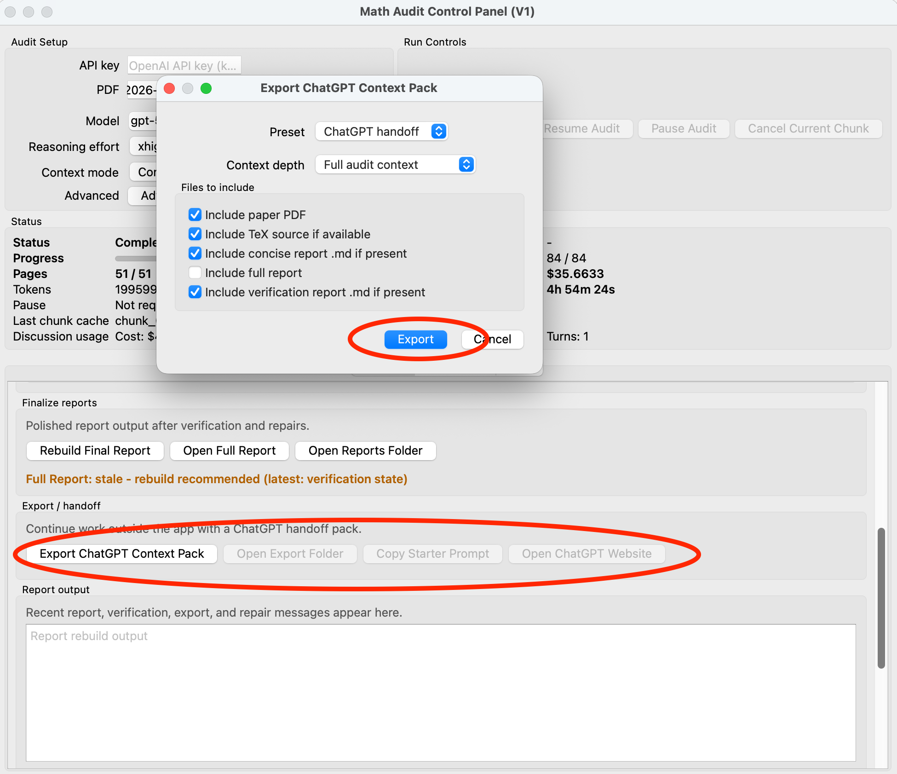

# Math Paper Audit User Guide

This guide walks through the public research-preview GUI.

Math Paper Audit helps a researcher audit a mathematical manuscript chunk by chunk with the OpenAI API, preserve audit state, build reports, and run local Python verification scripts. It is a human-assisted review tool, not a proof assistant, theorem prover, or automatic referee.

## What the App Does

Math Paper Audit breaks a mathematical paper into smaller pieces called chunks. For each chunk, it sends the chunk text and relevant context to the OpenAI API and asks the model to look for mathematical errors, proof gaps, notation problems, missing assumptions, inconsistent references, and other issues.

The app saves structured issue records as it works. After an audit, it builds two main report types:

- The **concise report** is the recommended first report to open. It focuses on the main actionable findings and is closer to a reader-facing or referee-style summary.
- The **full report** is a much longer, meticulous audit archive. It can be much longer than the original manuscript, sometimes ten or twenty times longer than the paper itself, because it preserves detailed per-chunk findings, local issues, verification suggestions, notes, and supporting context.

The app can also generate local Python verification scripts for some claims. Those scripts can provide useful supporting evidence, but they are not formal proofs.

All findings are provisional. The app is meant to help a human mathematician review a paper more systematically; it is not a theorem prover, proof assistant, automatic referee, or guarantee of correctness.

## Who Is This For?

Math Paper Audit is intended for researchers who want a structured, AI-assisted second pass through a mathematical manuscript. Typical uses include:

- Authors preparing a paper for journal or arXiv submission.
- Researchers checking a paper whose results are important for their own work.
- Referees or reviewers, only when journal policy, confidentiality rules, and the manuscript situation allow use of an external API-based tool.

In limited testing, the app has been able to find mathematical issues, proof gaps, incorrect references, and typographical errors in places that are easy to miss during ordinary reading. It can also help turn a long, difficult reading task into a more structured review process.

Use it cautiously. The app is not an automatic referee, proof assistant, or theorem prover. It can miss errors, overstate issues, and produce false positives. Findings are provisional and require human mathematical checking. For refereeing or review use, you are responsible for ensuring that use of an external API is allowed.

## Cost Expectations

API usage can cost real money. Cost depends on the model, reasoning effort, paper length, mathematical density, chunking, cached input, reruns, and model output length. Platform pricing can also change, so check OpenAI's current pricing page before running long audits:

- [OpenAI API pricing](https://openai.com/api/pricing/)

As a rough planning estimate, GPT-5.6 Sol with `xhigh` reasoning effort may cost about $1 per PDF page for mathematically dense audits. Nontechnical or expository pages may cost less, while proof-heavy pages may cost more. A 20-page PDF with GPT-5.6 Sol at `xhigh` may plausibly cost around $15-$25, but this is only an estimate, not a promise.

Cheaper models or lower reasoning effort can reduce cost, but they may noticeably reduce audit quality.

The app's local cost estimates are best-effort calculations from token usage metadata. They may differ from platform billing in edge cases; in particular, GPT-5.6 Sol cache-write charges are not estimated separately unless the API usage metadata exposes those token counts reliably.

> **Cost warning for GPT-5.5-pro:** GPT-5.5-pro is much more expensive than regular GPT-5.6 Sol or GPT-5.5. Its token rates are roughly 6 times higher, and it may not receive the same cached-input discount. Do not choose GPT-5.5-pro unless you are prepared for a much larger bill. A 20-page audit that might cost around $15-$25 with GPT-5.6 Sol or GPT-5.5 could plausibly exceed $100 with GPT-5.5-pro depending on token use and reasoning output.

## 1. Install Conda/Miniforge and Download Math Paper Audit

Math Paper Audit is currently distributed as a research-preview source package. It is not yet a packaged `.app` or Windows installer, and the launcher scripts do not bundle Python. The launchers need a working Conda or Mamba command so they can create or reuse a local `math-audit` environment for the app.

If you already have Anaconda, Miniconda, Miniforge, or Mambaforge installed, you can usually skip installing Miniforge and go straight to the launcher workflow below. The launcher searches for Conda/Mamba in your shell `PATH` and in common installation locations.

For new users, Miniforge is recommended because it is lightweight and uses conda-forge by default:

- [conda-forge download page](https://conda-forge.org/download/)
- [Miniforge GitHub repository](https://github.com/conda-forge/miniforge)

Choose the installer that matches your computer:

- macOS Apple Silicon: macOS arm64
- Intel Mac: macOS x86_64
- Windows: Windows x86_64

Miniforge needs about 400 MB for installation. The downloaded Math Paper Audit source folder is about 80 MB after unzipping. It contains the app source code, documentation, screenshots, launcher scripts, and bundled local GUI assets, but it does not include the installed Python/GUI libraries needed to run the app. On first launch, Conda creates a separate `math-audit` environment from `environment.yml` and downloads packages such as PySide6, Qt WebEngine, the OpenAI SDK, PDF-processing libraries, NumPy, SymPy, and Markdown. This environment can require several additional GB of disk space. We recommend at least 5 GB of free disk space, and 10 GB if possible. A full LaTeX distribution, if installed separately for PDF report compilation, requires additional space.

After installing Miniforge, you may need to restart Terminal or Command Prompt before Conda is visible to launcher scripts.

Existing Anaconda or Miniconda installations usually work, but very old, heavily customized, or misconfigured Conda installations can sometimes cause package-solving or environment-creation problems. If you see package conflicts or missing required packages, try rerunning the launcher, refreshing the environment, or installing Miniforge as a clean Conda option.

Then download Math Paper Audit:

1. Open the [Math Audit releases page](https://github.com/math-audit-lab/math-audit/releases).
2. Download the latest release source-code ZIP.
3. Unzip it.
4. Open the unzipped `math-audit` folder.
5. On macOS, double-click `run_math_audit.command`.
6. On Windows, double-click `run_math_audit.bat`.
7. The launcher creates or reuses the `math-audit` environment from `environment.yml`, runs a setup check, and starts the GUI.

Required Python/GUI packages are installed into the `math-audit` Conda environment from `environment.yml`. They are not supposed to be included in Miniforge itself. You should not manually install PySide6, Qt WebEngine, the OpenAI SDK, PDF parsing packages, NumPy, SymPy, Markdown, or similar app dependencies one by one.

If the setup check reports a missing required package, the environment may be incomplete or stale. Nontechnical users can try rerunning the launcher or ask a technical colleague for help. Advanced users can refresh the environment from the project root:

```bash
conda env update -f environment.yml --prune
```

If problems persist, creating the environment from a clean Miniforge installation may be the easiest path.

LaTeX is separate. `pdflatex` is optional but recommended if you want to compile generated `.tex` reports into PDF. The launcher does not install MacTeX, MiKTeX, or TeX Live.

The setup check does not call the OpenAI API or run an audit. Missing optional items such as `pdflatex` or an unset API key are reported as warnings.

## 2. Launching the GUI

If you used the macOS or Windows launcher, the GUI opens automatically after the setup check passes.

Advanced users can also start the app manually from an activated `math-audit` environment:

```bash
python audit_gui.py
```

On first launch, the app should open to the main audit setup screen. The stable public tabs are **Reports**, **Discussion**, and **Logs**. Experimental developer-only features are hidden by default.


## 3. API Key Setup

An OpenAI API key is a private access token that lets this local app send requests to the OpenAI API from your own OpenAI API account. It is different from simply being logged into ChatGPT in a browser.

The app needs an API key for live audit calls and live Discussion calls. Setup checks, opening existing reports, and reading existing audit outputs do not require an API key.

API usage can incur costs on your OpenAI API account. Check your OpenAI account billing and usage settings before running long audits.

To get a key, use OpenAI's official instructions and API key page:

- [Where do I find my OpenAI API Key?](https://help.openai.com/en/articles/4936850-where-do-i-find-my-openai-api-key)
- [OpenAI API Keys](https://platform.openai.com/api-keys)

For most users, the simplest app-side setup is to paste the key into the GUI API key field before starting or resuming an audit or using live discussion. The key is used for the current app session.

For advanced or developer use, you can instead set the key in the shell before launching the GUI:

```bash
export OPENAI_API_KEY="your_api_key_here"
python audit_gui.py
```

The current GUI live-call guard still expects the key to be entered in the GUI field, so the GUI field is the recommended public path.

Security reminders:

- Do not share your API key.
- Do not include it in screenshots.
- Do not commit it to Git.
- The full secret key is only shown when it is created; copy it somewhere safe, such as a password manager.
- If a key is lost or exposed, create a new key and revoke/delete the old one.

Never capture an API key in screenshots. If you need a screenshot of the setup area, clear the key field or use a mock placeholder that is not key-like.


## 4. Selecting a PDF and Optional TeX Source

> **Important: use searchable PDFs, not scanned PDFs.** Math Paper Audit depends on extractable text. Best results come from PDFs compiled from TeX/LaTeX, especially when the matching `.tex` source is available next to the PDF. A publisher or arXiv PDF without source may still work if its text is selectable/searchable. Scanned PDFs or image-only PDFs are not recommended: the app does not perform OCR, and scanned documents may produce empty, incomplete, or corrupted chunks, leading to unreliable audit results. A quick test is to open the PDF in a normal PDF viewer and try to select/copy a paragraph or formula. If you cannot select text, the PDF is probably not suitable.

Use **Browse...** to select a paper PDF. If a same-basename TeX source exists next to the PDF, for example:

```text
demo_paper.pdf
demo_paper.tex
```

the app will try TeX-aware chunking. If TeX is unavailable or incomplete, the app falls back to PDF text extraction. PDF-only mode is supported, but references and labels may be less precise.


## 5. Choosing a Context Mode

The default context mode is the continuous-conversation audit flow. It is the stable public default and may be cheaper for shorter PDF-only audits when context-cache reuse is good.

`fresh_context_experimental` is experimental. It may help with longer audits or robustness against accumulated conversation/file-service problems, but it is still a research feature and should be compared carefully before relying on it.


## 6. Starting an Audit

After selecting the PDF, choose model/reasoning settings and click **Start Fresh Audit**. The app will break the paper into chunks and audit them using OpenAI API calls. It creates an audit workdir next to the selected PDF; that folder contains the generated reports and saved audit state.

For serious research-level mathematical manuscript analysis, GPT-5.6 Sol with `xhigh` reasoning effort is the recommended default for new audits. GPT-5.5 remains selectable for comparison and compatibility with older runs. The `max` effort for GPT-5.6 Sol is available for the hardest quality-first audits or focused rechecks, but it is not the global default because it can increase latency and token use.

Lower reasoning effort or cheaper/earlier models can reduce cost, but they may noticeably reduce audit quality. It is reasonable to experiment with cheaper settings while testing the app or reading mostly expository material, but be cautious about relying on lower-quality settings for real mathematical auditing. Existing audits resume with the model and reasoning effort saved in their audit session.

For a paper named `demo_paper.pdf`, the default workdir is:

```text
demo_paper_audit/
```


## 7. Reading the Logs Tab

The **Logs** tab is the best place to monitor a running audit. It shows startup notes, selected PDF information, status changes, and per-chunk completion lines.

A chunk completion line may include:

- Chunk id, such as `chunk_012`.
- Overall chunk progress, such as `12/81`.
- Page progress when available.
- Chunk time for the just-finished chunk.
- Chunk cost for the just-finished chunk.
- Cumulative audit cost so far.
- Chunk tokens when available.
- Cumulative audit tokens so far.
- Total audit time when available.

`Chunk tokens` refers to the just-completed chunk. `Cumulative tokens` refers to all audit tokens counted so far.


## 8. Reports

After a successful audit, the app automatically generates the full audit report and the concise audit report. The verification report is generated after you run the verification suite; the app also refreshes the full and concise reports so newly reported counterexamples or claim failures are visible in the main conclusions.

The **concise report** is usually the first report to read. It emphasizes the main actionable findings and is better for deciding what matters. It is easier to read than the full report, but it is not automatically complete or authoritative; use the full report when you need detailed checking or audit provenance.

The **full report** is a detailed audit archive and meticulous technical report. It is useful for tracing every issue back to chunk-level output, local notes, verification suggestions, and supporting context. It can be much longer than the manuscript itself, sometimes ten or twenty times longer.

The **verification report** summarizes local Python verification results after you run the verification suite. Verification scripts are supporting evidence, not formal proof.

Generated report formats may include:

- Markdown reports for quick reading.
- TeX reports for local compilation.
- JSON sidecars for structured metadata.


Reports are written under the audit workdir, usually:

```text
demo_paper_audit/reports/
```

You can access them by opening that folder or by clicking **Open Full Report**, **Open Concise Report**, or **Open Verification Report** when the corresponding report exists. The app opens generated `.tex` files with your system default application for TeX files. If that is not the LaTeX editor/compiler you want, open the generated file manually in TeXShop, TeXworks, VS Code, or compile it from the command line with `pdflatex`.


## 9. Report Freshness

The GUI tracks whether reports may be stale after audit state, verification state, rerun state, issue state, or usage state changes. Stale reports can still be opened, but the warning tells you that a rebuild may be needed before relying on the report.

Use freshness warnings as a prompt to rebuild reports after reruns or verification changes.

## 10. Verification Suite

Some chunk audits generate local Python verification scripts. These are small Python programs for checking certain identities, inequalities, numerical examples, or bounded counterexample searches. The GUI reports two separate facts: whether Python execution completed, and what mathematical outcome the script reported.

Successful execution does not mean that the paper's claim passed. A script may execute normally and find a counterexample. Conversely, finding no counterexample in a finite tested range does not prove an unrestricted claim. Verification-derived findings are provisional supporting evidence and require human review. Counterexamples and reported claim failures are surfaced as prominent findings in the verification, full, and concise reports; scripts can still be wrong, so inspect the script, scope, and output before drawing conclusions.


## 11. Rerunning Failed Verification Chunks

If a verification script has a technical execution failure or times out, the GUI can help rerun chunks associated with those scripts. This technical workflow is for timeouts, runtime/parse errors, unsafe or skipped scripts, and missing/malformed execution. A script that executes successfully and finds a counterexample is not a technical rerun failure.

For an active `counterexample_found` or `claim_failed` finding, use **Recheck Counterexample Chunks** instead. This focused API action sends the complete manuscript chunk, full Python script, exact stdout/stderr and execution metadata, complete structured counterexample/failed cases, linked issues, source/printed labels when available, and compact neighboring/global context. It uses the audit session's saved model and reasoning effort by default and may incur additional API cost.

The recheck can classify the result as a confirmed counterexample/claim failure, script error, scope or hypothesis mismatch, notation or interpretation mismatch, or inconclusive. It does not replace the original chunk audit, verification script, result, or deterministic finding. Challenged and inconclusive findings remain visible for human review, and every recheck conclusion is provisional.

For a `script_error` conclusion, the recheck may propose a corrected primary script and a materially independent secondary check. The **Replacement verification scripts** panel shows the defect explanation, purpose, validation status, and latest local outcome. Use **Review Script** to inspect the complete source, then explicitly confirm **Run Safe Replacement Checks**. Proposed scripts are retained even when parsing, safe-mode, or structured-result validation fails, but invalid scripts are not executed. Original scripts and results are never overwritten.

Replacement execution is local and does not incur API cost. Its result remains provisional: “no counterexample found” applies only to the stated tested scope and is not a proof of an unrestricted claim. Timeouts, malformed output, unsafe code, or disagreement between replacement checks leave the finding unresolved and require human mathematical review.

Use either workflow selectively. A technical failure or negative result may indicate:

- The script is wrong.
- The paper claim is wrong.
- The audit misunderstood the claim.
- The test needs a different numerical or symbolic setup.

Reruns and counterexample rechecks can consume API budget. Confirm that an action is useful before starting it, and inspect the evidence and recheck explanation mathematically afterward.

## 12. Discussion and ChatGPT Context Export

### 12.1 Discussion tab

After an audit, the **Discussion** tab lets you ask follow-up questions inside the app using saved audit context. It uses the OpenAI API through the app, uses the app's configured API key, and may incur API costs.


### 12.2 ChatGPT Context Pack Export

The **ChatGPT Context Pack Export** is different from the in-app Discussion tab. It prepares a small set of exported files plus a starter prompt for continuing the audit discussion in the normal ChatGPT app. This gives ChatGPT background about the paper structure, audit findings, report summaries, verification information, and related audit state, so you can ask follow-up questions about the paper or the audit results in ChatGPT.

To use the export pack:

1. Click the context-pack export button in the app.
2. Open the exported folder.
3. Start a new ChatGPT conversation.
4. Paste the starter prompt from the export pack.
5. Attach the remaining exported files to the same ChatGPT conversation.
6. Ask follow-up questions about the paper or audit results.

This can be useful if you want to continue discussion in ChatGPT without spending additional API budget through this app. ChatGPT and the OpenAI API platform are billed separately, so ChatGPT usage is governed by your ChatGPT plan, file-upload limits, usage limits, and usage policies rather than this app's API key. The export is one-way: answers you get in ChatGPT are not automatically imported back into the audit state.

The exported files may contain manuscript text, audit findings, summaries, issue descriptions, and verification context. Only upload them to ChatGPT if you are allowed to share that manuscript/audit material there. Do not share export packs publicly unless they have been sanitized.



## 13. Output Folder Structure

An audit workdir may contain:

```text
demo_paper_audit/
  state/
  requests/
  responses/
  reports/
  logs/
  prompts/
  python_checks/
  verification_results/
  reruns/
  exports/
```

These artifacts are local review outputs. They may contain manuscript text, model responses, request metadata, local paths, cost details, and sensitive review analysis. They should stay out of Git unless you have intentionally created a sanitized demo fixture.

## 14. Privacy and Cost Warnings

Before using the app on a real manuscript:

- Confirm you are allowed to send the manuscript content to the selected model/API provider.
- Understand that audit requests and discussion turns can incur API costs.
- Avoid screenshots that reveal manuscript text, issue details, local paths, or API credentials.
- Keep generated audit folders private unless they have been deliberately sanitized.
- Treat all model-generated findings as provisional until checked by a human.

## 15. Troubleshooting

### The GUI Does Not Launch

Run:

```bash
python scripts/check_setup.py
```

If PySide6 or Qt WebEngine is missing, refresh the environment:

```bash
conda env update -f environment.yml --prune
```

### The App Logs an API-Key Warning

Paste your API key into the GUI API key field. Offline report reading and setup checks do not require an API key.

### TeX Reports Do Not Compile

Install a local TeX distribution if you want PDF output from generated `.tex` reports. Markdown and JSON reports remain available without LaTeX.

### PDF-Only Chunking Looks Imprecise

PDF-only mode depends on text extraction quality. If possible, place a matching `.tex` source next to the PDF and start a fresh audit with TeX-aware chunking.

### A Report Is Marked Stale

Rebuild the report after reruns, verification changes, or issue-state changes. Stale reports are still readable, but they may not reflect the latest audit state.

### Verification Results Are Confusing

Open the script and result details. A verification result is not a formal proof; it is a local sanity check or counterexample search that needs mathematical interpretation.
