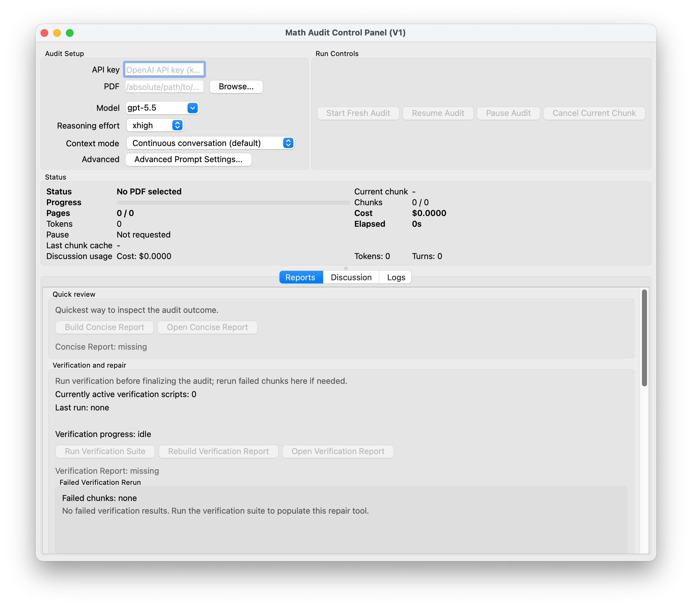
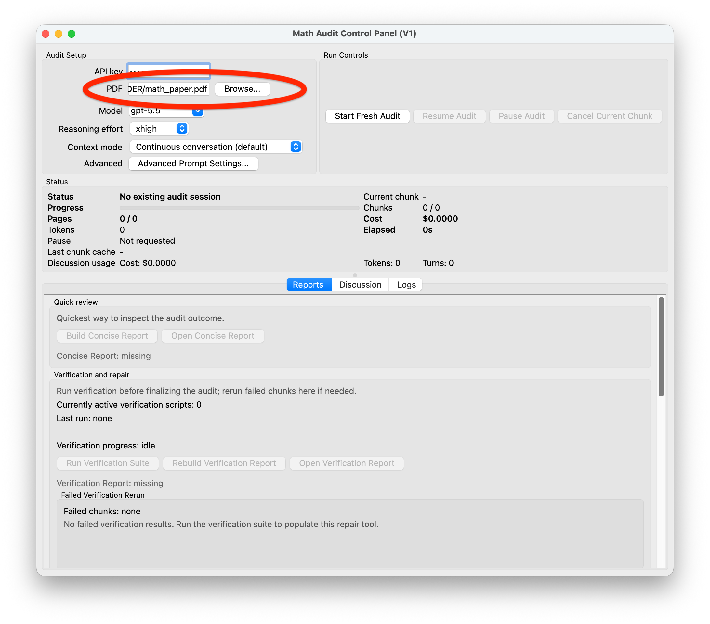
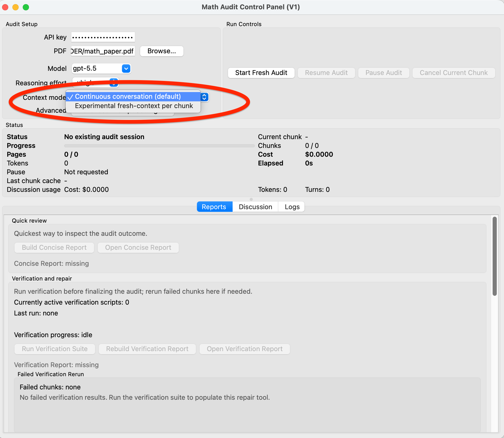
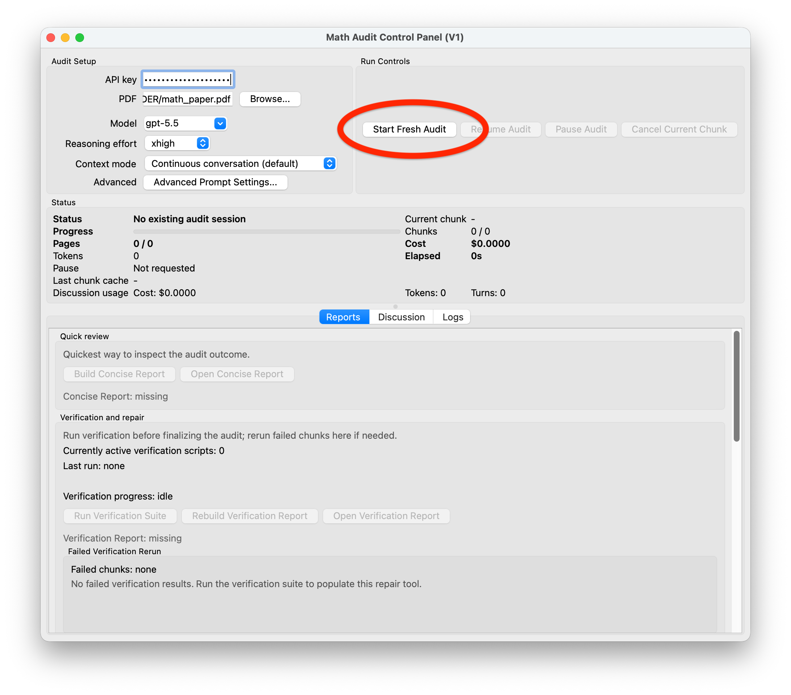
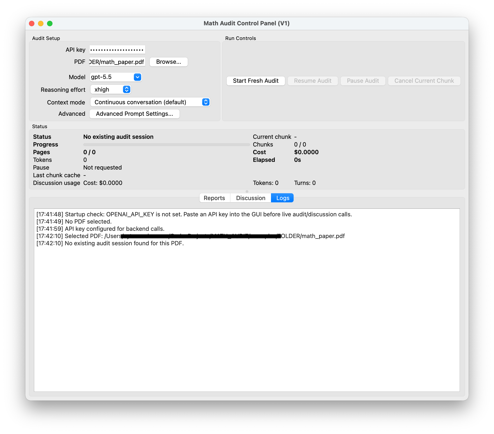
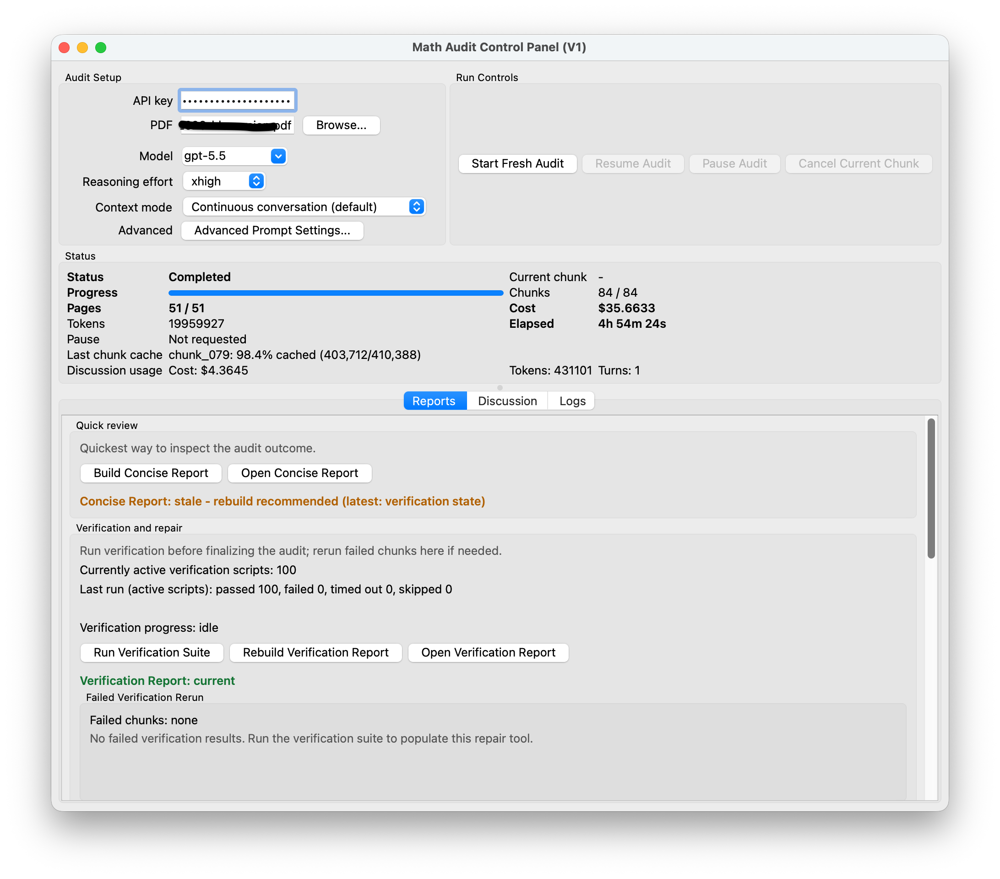
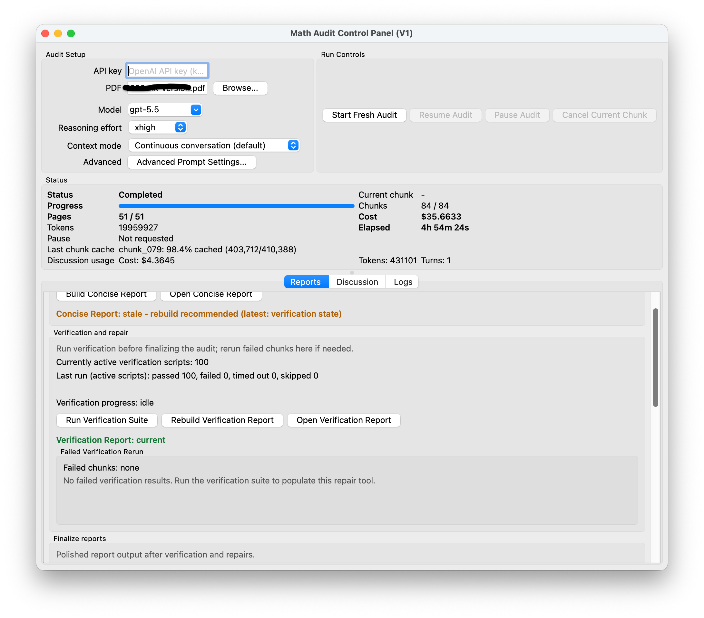
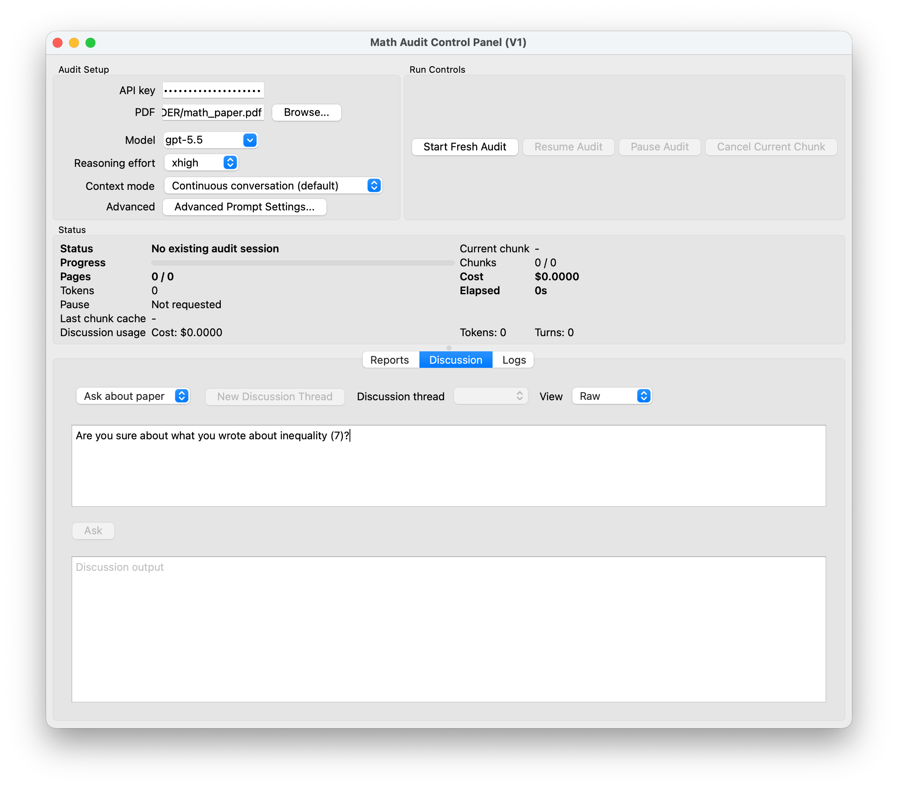

# Math Paper Audit User Guide

This guide walks through the public research-preview GUI.

Math Paper Audit helps a researcher audit a mathematical manuscript chunk by chunk with the OpenAI API, preserve audit state, build reports, and run local Python verification scripts. It is a human-assisted review tool, not a proof assistant, theorem prover, or automatic referee.

## 1. Installation Assumptions

The public preview is mainly tested on macOS with a Conda environment. The GUI depends on PySide6, Qt WebEngine, the OpenAI Python SDK, PDF parsing packages, and optional local LaTeX tooling for compiling generated TeX reports.

Follow the quick setup in [`../QUICKSTART.md`](../QUICKSTART.md):

```bash
conda env create -f environment.yml
conda activate math-audit
python scripts/check_setup.py
```

The setup check does not call the OpenAI API or run an audit. Missing optional items such as `pdflatex` or an unset API key are reported as warnings.


## 2. Launching the GUI

Start the app from the activated environment:

```bash
python audit_gui.py
```

On first launch, the app should open to the main audit setup screen. The stable public tabs are **Reports**, **Discussion**, and **Logs**. Experimental developer-only features are hidden by default.



## 3. API Key Setup

An OpenAI API key is a private access token that lets this local app send requests to the OpenAI API from your own OpenAI API account. It is different from simply being logged into ChatGPT in a browser.

The app needs an API key for live audit calls and live Discussion calls. Setup checks, opening existing reports, and reading existing audit outputs do not require an API key.

API usage can incur costs on your OpenAI API account. Check your OpenAI account billing and usage settings before running long audits.

To get a key, use OpenAI's official instructions and API key page:

- [Where do I find my OpenAI API Key?](https://help.openai.com/en/articles/4936850-where-do-i-find-my-openai-api-key)
- [OpenAI API Keys](https://platform.openai.com/api-keys)

For most users, the simplest app-side setup is to paste the key into the GUI API key field before starting or resuming an audit or using live discussion. The key is used for the current app session.

For advanced or developer use, you can instead set the key in the shell before launching the GUI:

```bash
export OPENAI_API_KEY="your_api_key_here"
python audit_gui.py
```

The current GUI live-call guard still expects the key to be entered in the GUI field, so the GUI field is the recommended public path.

Security reminders:

- Do not share your API key.
- Do not include it in screenshots.
- Do not commit it to Git.
- The full secret key is only shown when it is created; copy it somewhere safe, such as a password manager.
- If a key is lost or exposed, create a new key and revoke/delete the old one.

Never capture an API key in screenshots. If you need a screenshot of the setup area, clear the key field or use a mock placeholder that is not key-like.


## 4. Selecting a PDF and Optional TeX Source

Use **Browse...** to select a paper PDF. If a same-basename TeX source exists next to the PDF, for example:

```text
demo_paper.pdf
demo_paper.tex
```

the app will try TeX-aware chunking. If TeX is unavailable or incomplete, the app falls back to PDF text extraction. PDF-only mode is supported, but references and labels may be less precise.



## 5. Choosing a Context Mode

The default context mode is the continuous-conversation audit flow. It is the stable public default and may be cheaper for shorter PDF-only audits when context-cache reuse is good.

`fresh_context_experimental` is experimental. It may help with longer audits or robustness against accumulated conversation/file-service problems, but it is still a research feature and should be compared carefully before relying on it.




## 6. Starting an Audit

After selecting the PDF, choose model/reasoning settings and click **Start Fresh Audit**. The app will break the paper into chunks and audit them using OpenAI API calls. It creates an audit workdir next to the selected PDF; that folder contains the generated reports and saved audit state.

For a paper named `demo_paper.pdf`, the default workdir is:

```text
demo_paper_audit/
```




## 7. Reading the Logs Tab

The **Logs** tab is the best place to monitor a running audit. It shows startup notes, selected PDF information, status changes, and per-chunk completion lines.

A chunk completion line may include:

- Chunk id, such as `chunk_012`.
- Overall chunk progress, such as `12/81`.
- Page progress when available.
- Chunk time for the just-finished chunk.
- Chunk cost for the just-finished chunk.
- Cumulative audit cost so far.
- Chunk tokens when available.
- Cumulative audit tokens so far.
- Total audit time when available.

`Chunk tokens` refers to the just-completed chunk. `Cumulative tokens` refers to all audit tokens counted so far.



## 8. Reports

After a successful audit, the app automatically generates the full audit report and the concise audit report. The verification report is generated after you run the verification suite.

Generated report formats may include:

- Markdown reports for quick reading.
- TeX reports for local compilation.
- JSON sidecars for structured metadata.


Reports are written under the audit workdir, usually:

```text
demo_paper_audit/reports/
```

You can access them by opening that folder or by clicking **Open Full Report**, **Open Concise Report**, or **Open Verification Report** when the corresponding report exists. The app opens generated `.tex` files with your system default application for TeX files. If that is not the LaTeX editor/compiler you want, open the generated file manually in TeXShop, TeXworks, VS Code, or compile it from the command line with `pdflatex`.



## 9. Report Freshness

The GUI tracks whether reports may be stale after audit state, verification state, rerun state, issue state, or usage state changes. Stale reports can still be opened, but the warning tells you that a rebuild may be needed before relying on the report.

Use freshness warnings as a prompt to rebuild reports after reruns or verification changes.

## 10. Verification Suite

Some chunk audits generate local Python verification scripts. These are small Python programs for checking certain identities, inequalities, or numerical examples. The GUI can discover and run these scripts, then show PASS, FAIL, TIMEOUT, or SKIPPED outcomes.

Verification scripts are supporting evidence only, not formal proof. A PASS can mean different things depending on what the script was designed to test, including successfully finding a counterexample to a suspected claim. Always inspect the script purpose and output before drawing mathematical conclusions. Scripts can fail because of programming issues rather than underlying mathematical problems.



## 11. Rerunning Failed Verification Chunks

If a verification script fails or times out, the GUI can help rerun chunks associated with failed verification scripts. Use this selectively. A failed script may indicate:

- The script is wrong.
- The paper claim is wrong.
- The audit misunderstood the claim.
- The test needs a different numerical or symbolic setup.

Reruns can consume API budget. Confirm that a rerun is useful before starting it.

## 12. Discussion and Context Export

After an audit, the **Discussion** tab can ask follow-up questions using saved audit context. The app also supports a one-way ChatGPT context-pack export from the reports area. The export is manual: it prepares files and a starter prompt for you to attach/paste elsewhere.




## 13. Output Folder Structure

An audit workdir may contain:

```text
demo_paper_audit/
  state/
  requests/
  responses/
  reports/
  logs/
  prompts/
  python_checks/
  verification_results/
  reruns/
  exports/
```

These artifacts are local review outputs. They may contain manuscript text, model responses, request metadata, local paths, cost details, and sensitive review analysis. They should stay out of Git unless you have intentionally created a sanitized demo fixture.

## 14. Privacy and Cost Warnings

Before using the app on a real manuscript:

- Confirm you are allowed to send the manuscript content to the selected model/API provider.
- Understand that audit requests and discussion turns can incur API costs.
- Avoid screenshots that reveal manuscript text, issue details, local paths, or API credentials.
- Keep generated audit folders private unless they have been deliberately sanitized.
- Treat all model-generated findings as provisional until checked by a human.

## 15. Troubleshooting

### The GUI Does Not Launch

Run:

```bash
python scripts/check_setup.py
```

If PySide6 or Qt WebEngine is missing, refresh the environment:

```bash
conda env update -f environment.yml --prune
```

### The App Logs an API-Key Warning

Paste your API key into the GUI API key field. Offline report reading and setup checks do not require an API key.

### TeX Reports Do Not Compile

Install a local TeX distribution if you want PDF output from generated `.tex` reports. Markdown and JSON reports remain available without LaTeX.

### PDF-Only Chunking Looks Imprecise

PDF-only mode depends on text extraction quality. If possible, place a matching `.tex` source next to the PDF and start a fresh audit with TeX-aware chunking.

### A Report Is Marked Stale

Rebuild the report after reruns, verification changes, or issue-state changes. Stale reports are still readable, but they may not reflect the latest audit state.

### Verification Results Are Confusing

Open the script and result details. A verification result is not a formal proof; it is a local sanity check or counterexample search that needs mathematical interpretation.
